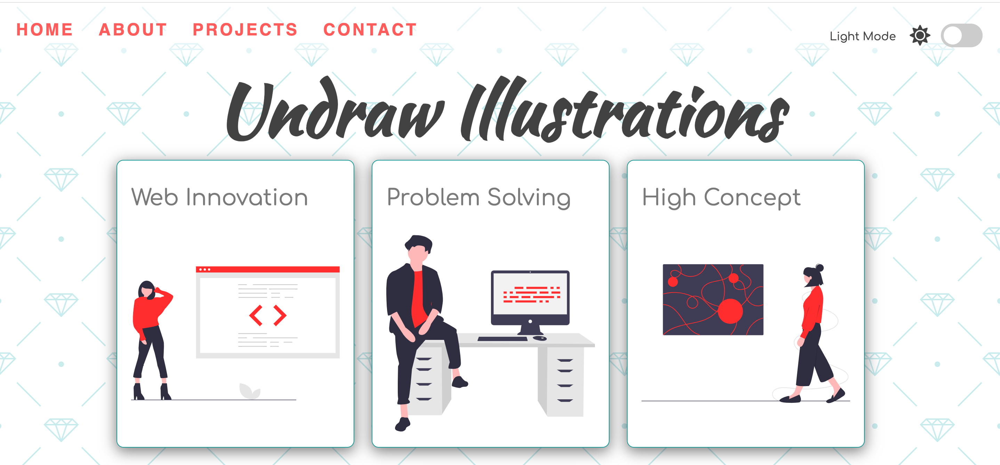

# Light & Dark Mode

## Description

Exercise Project of `ZTM` Cours on Udemy ([JavaScript Web Projects: 20 Projects to Build Your Portfolio](https://www.udemy.com/course/javascript-web-projects-to-build-your-portfolio-resume)).

> Programming in `vanilla js`

> [!NOTE]
> Style is **non-responsive**

## Examples

## Useful references

- [The Ultimate Guide on Designing a Dark Theme for your Android app](https://blog.prototypr.io/how-to-design-a-dark-theme-for-your-android-app-3daeb264637)
- [Using CSS custom properties (variables)](https://developer.mozilla.org/en-US/docs/Web/CSS/Using_CSS_custom_properties)
- [unDraw](https://undraw.co/illustrations)
- [fontawesome](https://fontawesome.com/icons?d=gallery&q=close&m=free)
- [w3schools: How TO - Toggle Switch](https://www.w3schools.com/howto/howto_css_switch.asp)
- [w3schools: onchange Event](https://www.w3schools.com/jsref/event_onchange.asp)
- [Document: documentElement property](https://developer.mozilla.org/en-US/docs/Web/API/Document/documentElement)
- [w3schools: Window localStorage](https://www.w3schools.com/jsref/prop_win_localstorage.asp)
- [Window: localStorage property](https://developer.mozilla.org/en-US/docs/Web/API/Window/localStorage)